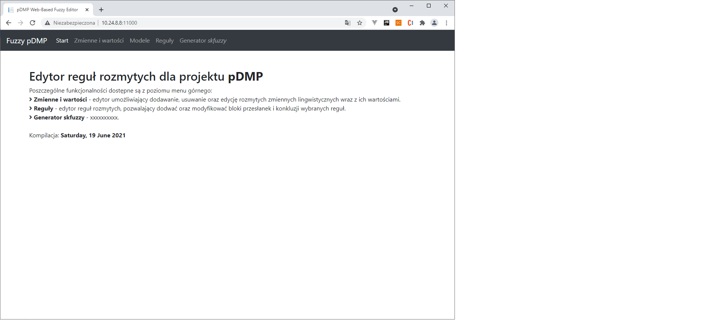
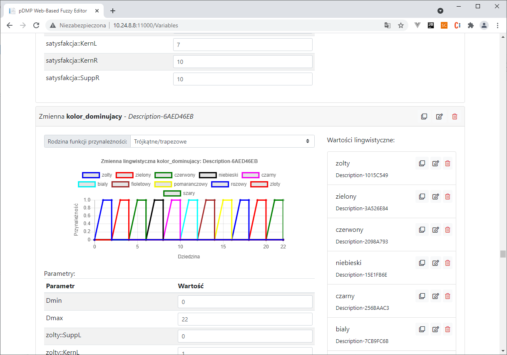
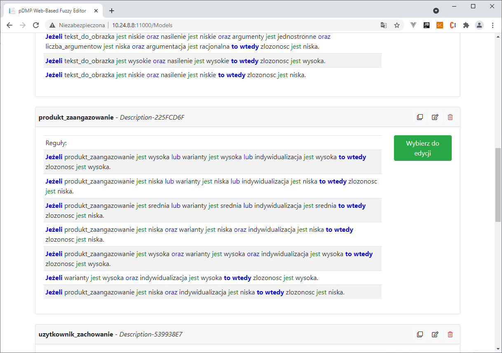
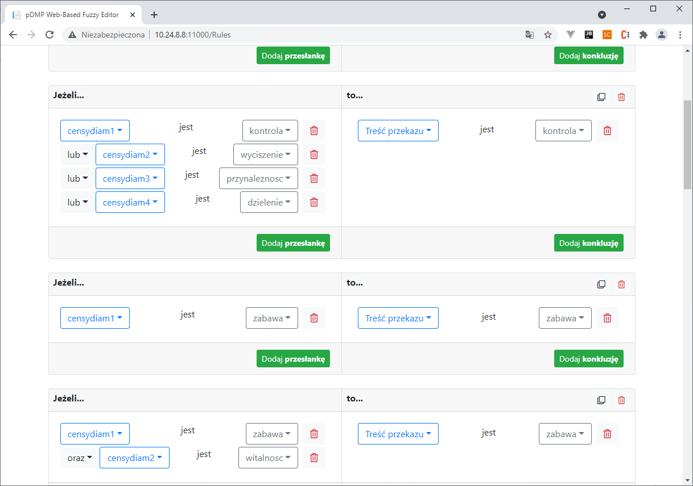
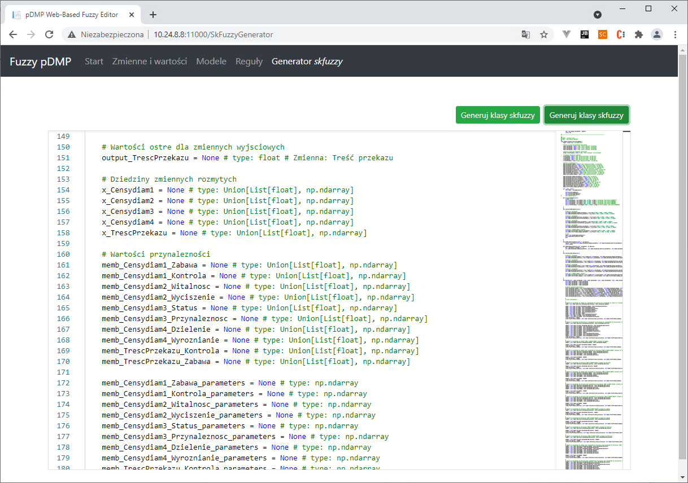

# FuzzyPDMP

Edytor FuzzyPDMP przygotowano z myślą o wygodnym i łatwym modelowaniu wiedzy eksperckiej w formie relacji wejście-wyjście.
Pozwala on budowanie modeli z wykorzystaniem teorii zbiorów rozmytych oraz logiki rozmytej.

## Ekran startowy

Właściwe budowanie odbywa zrealizowano za pomocą wysokopoziomowych operacji, wykonywanych na rzecz rozmytych wartości zmiennych lingwistycznych.

## Edytor rozmytych zmiennych lingwistycznych

Do zapisu właściwej wiedzy eksperckiej dostępna jest wydzielona funkcjonalność budowania bazy reguł w ramach definiowanego modelu wnioskowania, opartego na wnioskowaniu Mamdaniego.

## Menu wyboru modeli rozmytych

Można zatem stwierdzić, iż edytor wspiera podejście polegające na definicji dziedziny problemu w pierwszej kolejności (pojęcia wejściowe oraz wejściowe) a następnie na wypełnieniu jej zależnościami - wiedzą eksperta.

## Edytor reguł w modelu rozmytym

Dla każdego przygotowanego modelu rozmytego edytor pozwala wygenerować kod źródłowy w języku Python (w wersji 3.8), realizujący utworzone wcześniej modele z regułami. 
Kod źródłowy przystosowany jest do szybkiego wizualizowania działania modeli oraz posiada możliwość optymalizacji parametrów wprowadzonych na etapie edycji, w ramach mechanizmu optymalizacji numerycznej.

## Generator kodu

Edytor FuzzyPDMP opracowano z wykorzystaniem języka C# oraz .Net Core 3.0, w formie usługi Blazor Server, uruchamianej w kontenerze Docker.
